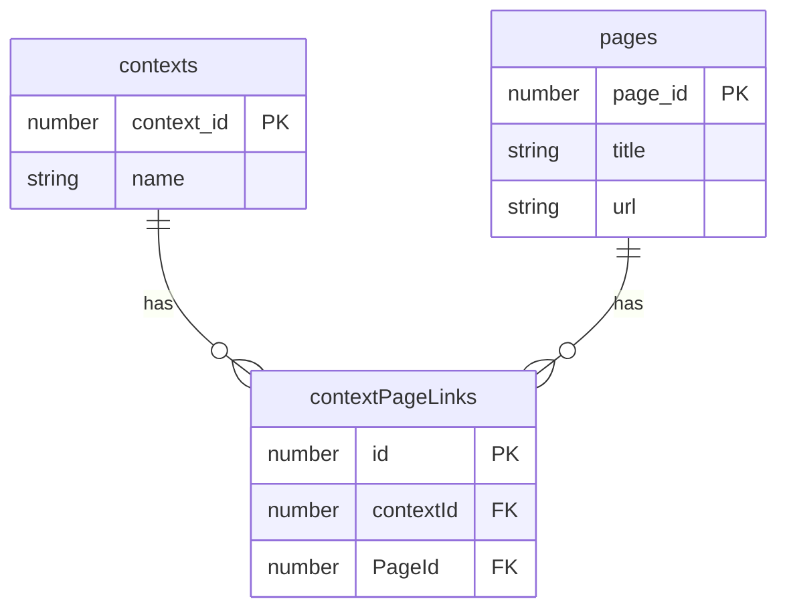

# ![Content Manager Logo][logo] Content Manager Chrome Extension

![Context manager banner][banner]

[Content Manager](https://chromewebstore.google.com/detail/content-manager/lobbohngjkkghmganebnahlfajlahkic) is a powerful Chrome extension that helps you organize and manage your browsing sessions by creating and switching between different contexts. Each context represents a group of related web pages that you frequently access together

# Summary

- [Purpose](#Purpose)
- [How to install ?](#Install-the-Extension)
- [How It Works](#How-It-Works)
- [Features](#Features)
- [Use Cases](Use-Cases)
- [Development](#Development)
  - [Technical Details](#Technical-Details)
  - [Encountered Development Errors](#Encountered-Development-Errors)
  - [Why did i make this project ?](#Why-did-i-make-this-project-?)
  - [TODO List](#TODO-List)

# Purpose

![Content Manager presentation page][presentation-page]
The main purpose of Content Manager is to help you maintain focus and productivity by organizing your browsing sessions into logical groups. For example:

- **Work Context**: All the tabs you need for your job (email, project management, documentation)
- **Development Context**: Your coding environment, GitHub, Stack Overflow, and other developer tools
- **Personal Context**: Social media, news sites, and personal projects
- **Study Context**: Educational resources, research papers, and learning platforms

# Install the Extension

You can install it on the
👉[Chrome web store](https://chromewebstore.google.com/detail/content-manager/lobbohngjkkghmganebnahlfajlahkic)  
or 👉[in the mozzilla firefox add-ons](https://addons.mozilla.org/pl/firefox/addon/content-manager/)

You can also manually download the latest ready-to-use version here:
👉 [GitHub Releases](https://github.com/DawidSac24/ContentManager/releases)
Follow these steps to use it:

1. Extract the ZIP
2. Go to `chrome://extensions`
3. Enable Developer Mode
4. Click "Load Unpacked"
5. Select the extracted folder

# How It Works

1. **Create Contexts**: Define different contexts with custom names and icons
2. **Save Your Context**: Add your currently open pages to your selected context
3. **Switch Contexts**: With a single click, switch between contexts:
   - Open all the pages associated with your selected context
   - You can instantly shift your focus from work to study, or from personal to development

# Features

- **Context Management**: Create, edit, and delete contexts
- **Page Organization**: Group related pages into contexts
- **Quick Switching**: Instantly switch between different browsing environments
- **Persistence**: Your contexts and pages are saved between browser sessions

![Content Manager second presentation page][presentation-page-2]

# Use Cases

- **Work-Life Balance**: Keep your work and personal browsing separate
- **Project Management**: Create contexts for different projects
- **Learning**: Organize educational resources by subject or course
- **Research**: Group research materials by topic
- **Development**: Switch between different development environments

# Development

This project is currently is mostly finished. Some major futures are planned to be added.

## Technical Details

Content Manager consists of:

- A Chrome extension frontend built with **Vite** and **React TypeScript**
- A local server with back-end implementation inside of Vite
- A **IndexedDB** local database

### The Project Diagram

> [!NOTE]  
> This database diagram should not have an id in the contextPageLinks table. Since it isn't possible to define a composed primary key, i had to add a id to this table and make the contextId and pageId only Foreign Keys.

## Encountered Development Errors

I initially created the project's database with the pages table inside the contexts table, thinking it would be a better development approach since there is only one pages table per context and it would allow easier data access. I quickly realized that this implementation required me to pass the entire Context object just to update its pages, and it could slow down the loading of contexts since they are loaded along with the pages. This might not be a problem for my small extension, but it would be better practice to make it more optimized.

## Why did i make this project ?

I decided to make this project mainly to try to apply the things that i learned in school on a real project. This helped me to have a better idea of how the real world web developpement might look and what are the general problemes that i may encounter and find a solution for. This project made me decide and make some important architechture and developement decisions and learn about the different flaws/compromises of each implementation choice that i made.
I also wanted to learn some new technologies and develop some that i arleady knew.  
Developping a project like this made me acquire experiance that i would not have by only going to school and, most importantly, it was a lot of fun!

## TODO List

- [ ] add test files
- [ ] Add a settings option that opens a web page for better context management, more settings, and customization (e.g., deleting selected pages from a context)
- [ ] Set up a server to allow user synchronization between devices

[logo]: https://github.com/DawidSac24/ContentManager/blob/main/assets/logo-48px.png
[banner]: https://github.com/DawidSac24/ContentManager/blob/main/assets/cm-banner.jpg
[presentation-page]: https://github.com/DawidSac24/ContentManager/blob/main/assets/cm-ss1.jpg
[presentation-page-2]: https://github.com/DawidSac24/ContentManager/blob/main/assets/cm-ss2.jpg
[DSD]: https://github.com/DawidSac24/ContentManager/blob/main/assets/DSD.png
